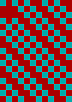
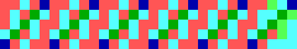

# gWASD
A simple joke language inspired by [WASD](https://esolangs.org/wiki/WASD) for graphical programming.

## Live editor
There is a live editor available [here](https://projects.zachspi.ddns.net/gWASD/gWASD.html)

## Commands
- `w` - Move pointer up one row
- `a` - Move pointer left one column
- `s` - Move pointer down one row
- `d` - Move pointer right one row
- `n` - Decrement location's value
- `p` - Increment location's value
- `x` - Screen size separator
- `g` - Go (back)
- `b` - Branch (on zero)
- `(` - Begin comment
- `)` - End comment

**Note:** All increment/decrement commands will rollover if their operation would result in a pointer or value outside of its acceptable range.
- Whitespace is ignored.
- Screen colors are defined by the default EGA color pallet ([wikipedia](https://en.wikipedia.org/wiki/Enhanced_Graphics_Adapter#Color_palette)). This means that there is only 16 colors available.
- All commands are case-insensitive.

## Syntax
- Screen size: `wwwxhhh` must be placed at the beginning of the file (otherwise the image dimensions will be unknown). `www` is the width of the image in pixels, while `hhh` is the height in pixels.
- Move commands simply move the pointer, so by running a `w`, the pointer is simply moved up one location. Same goes for increment/decrement operations.
- The Go command takes an argument for how many characters it is supposed to back up (i.e. `g1` would loop back to itself while `g3` would execute the previous two commands in a loop).
- Decisions: `b` takes similar syntax to the Go command. It branches (back) by a specified index delta if the current pixel is of value 0.
- Comments are enclosed by `()` and comments may not contain parentheses.

## Examples
### Loop
```
12x17sdpg4 (Loop forever)
```
Set the screen to 128 (width) by 32 (height) pixels. Then go down-left and increment that pixel's value. Then loop that forever.\


### Hello World
```
74x10
sdnsnsnsnsnsnsnwwwdndndndnwwwnsnsnssnsnsn(H)
ddndndndndnwwwanananasnsnwwnwnwnwndndndndn(E)
ddnsnsnsnsnsnsndndndndn(L)ssss
ddnsnsnsnsnsnsndndndndn(L)
dddndndndwnwnwnwnwnwanananasnsnsnsnsn(O)
ddddddddddd( )
wwwwwnsnsnsnsnsnsdndwnwnwnsssdndwnwnwnwnwnwn(W)w
wwwdddndndndwnwnwnwnwnwanananasnsnsnsnsn(O)dddddds
nwnwnwnwnwnwndndndndsnsnsananandsndsndsn(R)ssss
ddnsnsnsnsnsnsndndndndn(L)ssssdd
ndnsnsnsnsnsnsnanddndndwnwnwnwnwnwanan(D)dddddddd
nsnsnsnsnssn(!)ssddd
dpg4
```


### Branching
```
30x5
pspspspsb10
dg14
```


